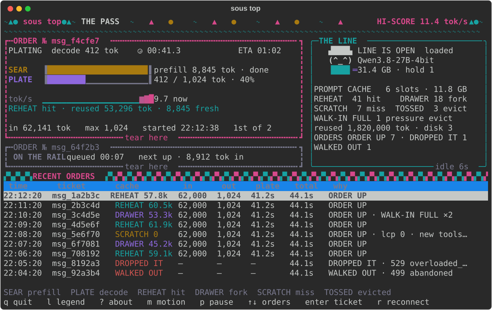

# sous

Keep Claude on Claude Code's main loop and run its subagents on your Mac.

sous is a local daemon for Apple silicon that sits between Claude Code and
Anthropic. Claude Code's main conversation — the planning, the decisions, the
review — goes to Anthropic exactly as before, on your own Pro/Max login. The
subagents it spawns (Explore, general-purpose, your own agents) are answered
by a local MLX model instead, so the tokens they generate don't count against
your plan. Claude Code still runs every tool itself, under its own permission
mode; sous runs nothing. Claude is the head chef; the local model does the
prep.

```
                              ┌─► api.anthropic.com   the main loop and every other request,
Claude Code ──► sous daemon ──┤                       forwarded byte for byte on your login
                127.0.0.1     └─► local MLX model     subagent turns (model id sous-local)
```

You need an Apple silicon Mac with ~18 GB of unified memory free for the
default model (a ~16 GB download), and a Claude Pro or Max plan. Only
sessions you start with `sous claude` go through sous; plain `claude` is
untouched.

## Why use it

Heavy Claude Code use runs into plan usage limits, and a large share of what
spends them can be output a subagent generates: files read and summarised,
code searched, a module drafted. sous moves that output onto your Mac, where
a token costs no plan usage, and leaves Claude the part that needs a frontier
model: deciding what to delegate and reviewing what comes back.

- **Claude stays in charge.** The full-local setups below point every Claude
  Code request, the main loop included, at the local model. sous forwards the
  main loop untouched, so only delegated work drops to local-model quality.
- **One install, one launcher.** sous is both the router and the model
  server. `sous claude` starts Claude Code wired to it: no proxy to pair with
  a server, no API key, no settings file edited, and your login is never
  stored or re-issued — the daemon passes Claude Code's own requests,
  credentials included, to Anthropic and nowhere else.
- **Built around Claude Code's requests.** Every Claude Code subagent starts
  with ~45–56K tokens of tool definitions, identical across sessions and
  projects for a given subagent type. sous keeps that prefix as a *fork*, cut
  at the exact end of the tool block, in memory and on disk: once any session
  has built it, a new session's first local turn took 16 s instead of 170 s
  on the default model, and 15.7 s instead of 175.5 s right after a daemon
  restart.
- **Tuned for your machine.** `sous tune` (about 15 minutes quick, about
  three hours in full) measures and grades candidate models on your Mac and
  proposes the configuration.

What it will not do for you:

- **It is not fast.** The default model (Qwen3.8-27B, 4-bit, with a DFlash2
  speculative drafter) decodes at about 31 tok/s with 2K tokens of context
  and about 19.5 tok/s at 57K on an M5 Pro, sampling as shipped. It prefills
  at about 480 tok/s on a 4K prompt and about 350 tok/s on a 61K one: a
  subagent's first turn takes about three minutes when nothing is cached,
  and 16 s from a fork. Several engines in the table below publish higher
  decode speeds for the same model family, one of them (LM Studio's Splash)
  on an M5 Pro, all with other prompts and settings; none has been measured
  side by side with sous.
- **It serves one local turn at a time.** Subagents running in parallel
  queue for the model.
- **It does not choose per agent.** In a `sous claude` session every
  subagent goes local, including agents pinned to a Claude model.
- **It does not make the local model as good as Claude.** Delegated work is
  done at local-model quality and Claude reviews what comes back. `sous tune`
  grades candidates on eight mechanical coding tasks on your machine; this
  README publishes no quality benchmark.
- **It does not measure what it saves.** How much of your plan it saves
  depends on how much work Claude Code hands to subagents. The main loop
  still reads every subagent's result, and in auto mode each classified
  action is one request forwarded to Anthropic.
- **Anthropic does not support it.** Anthropic's
  [gateway documentation](https://code.claude.com/docs/en/llm-gateway)
  describes the mechanism sous relies on — with only `ANTHROPIC_BASE_URL`
  set, "a saved claude.ai login remains the active credential" — and says
  Anthropic "doesn't support routing Claude Code to non-Claude models through
  any gateway". sous runs the unmodified Claude Code, stores no credential
  and forwards Claude Code's own requests unchanged; read Anthropic's
  [credential-use terms](https://code.claude.com/docs/en/legal-and-compliance#authentication-and-credential-use)
  and decide for yourself.

## How it compares

Checked on 2026-09-25 against oMLX 0.7.0rc1, MTPLX 2.12.0, mlx-dspark 0.19.0,
mlx-serve 26.9.5, claude-code-router 3.1.1, Ollama 0.34.4 and LM Studio 0.4.25.

| | Main loop runs on | Engine | Speculative decoding | Parallel requests | Prompt cache across sessions | Interface |
|---|---|---|---|---|---|---|
| **sous** | Claude, on your own login | MLX, one model | A draft model (DFlash2) | No, one turn at a time | Yes, at the end of the tool block; kept on disk | CLI, terminal UI |
| [oMLX](https://github.com/jundot/omlx) | The local model | MLX, many models at once | A draft model or the model's MTP heads, opt-in | Yes, 8 by default | Yes, in 2K–4K-token blocks; kept on SSD (see below) | Menu-bar app, web dashboard, CLI |
| [MTPLX](https://github.com/youssofal/MTPLX) | The local model | MLX, one model | The model's MTP heads, on its own model packs | Opt-in on the CLI; 4 for the app's Claude Code target | Yes, from the nearest saved checkpoint; kept on SSD | Mac app, CLI, web dashboard |
| [mlx-dspark](https://github.com/ARahim3/mlx-dspark) | The local model | MLX, one model | Draft models (DSpark, DFlash), n-gram lookup | Opt-in | Yes, in memory (2 slots); lost on restart | Mac app, CLI |
| [mlx-serve](https://github.com/ddalcu/mlx-serve) | The local model | MLX and llama.cpp, many models; no Python | The model's MTP heads, draft models, n-gram lookup | Opt-in | In memory, 2 GB by default; SSD opt-in | Menu-bar app, CLI, web console |
| [claude-code-router](https://github.com/musistudio/claude-code-router) | Any provider; or Claude, via an imported copy of your login token | None: routes to other servers | — | Passed through; the server decides | None of its own | Desktop app, CLI, web UI |
| [Ollama](https://github.com/ollama/ollama) | The local model, or Ollama Cloud | llama.cpp and its own MLX runner, many models | MTP heads or a draft model, when the model ships one | Opt-in; never for Qwen3.5/3.8 | Yes, in memory; lost on unload (5 idle minutes by default) | CLI, desktop app |
| [LM Studio](https://lmstudio.ai) | The local model | llama.cpp, MLX and Splash, many models | On llama.cpp and Splash; not on MLX for Qwen3.5/3.8 | Yes, 4 by default | Yes; lost on unload | Desktop app and headless daemon (closed source), CLI |

"The local model" means the project's own Claude Code launcher or guide
sends the whole session to the local server and sets `ANTHROPIC_AUTH_TOKEN`,
which takes it off your subscription login; none of the model servers
forwards Claude Code's requests to Anthropic. That is the right trade if you
have no Claude plan or want to work offline, and then any of them serves you
better than sous, which needs Anthropic for the main loop.

Two details the table cannot hold. On MTPLX, mlx-dspark and LM Studio's MLX
engine, parallel requests and speculative decoding do not combine on
Qwen3.5/3.8; oMLX, mlx-serve and LM Studio's Splash engine batch drafted
requests together. And oMLX [#3317](https://github.com/jundot/omlx/issues/3317)
(open) reports that 0.6.4 skips most prefix-cache stores on Qwen3.8-27B,
sous's default model; the maintainer has not reproduced it, and 0.7.0rc1
lists no fix.

The hybrid itself is not unique to sous.
[claudish](https://github.com/MadAppGang/claudish),
[claude-code-router](https://github.com/musistudio/claude-code-router),
[claude-sub-proxy](https://github.com/gaztrabisme/claude-sub-proxy),
[subagent-handoff](https://github.com/1morr/subagent-handoff) and
[cc-local-router](https://github.com/andrewleech/cc-local-router) can each
sit in front of any server above (all of them serve Anthropic's Messages
API), keep the main loop on Anthropic and send subagents to the local model,
with catches of their own: claude-code-router, for one, sends a copy of your
login token itself and strips Claude Code's attribution block from every
request, and cc-local-router runs a patched Claude Code binary. What sous
adds is the router and the engine as one daemon, a prompt cache that forks
at the exact end of Claude Code's tool block (measured on the hybrid
Qwen3.8 model it defaults to), and a per-session launcher that leaves your
login, the main loop's model and Claude Code's compaction settings alone. It
does turn off the LSP tool and lengthen the API timeout for the session.

Choose something else when:

- **You want parallel requests or many models:** oMLX batches eight
  requests by default and serves several models at once; LM Studio batches
  four.
- **You want images:** most of the engines above take them; sous replaces
  them with a placeholder.
- **You want higher decode speeds on Qwen:** MTPLX and mlx-serve run the
  model's own multi-token-prediction heads and LM Studio's Splash engine
  pairs Qwen3.8-27B with a DFlash2 drafter; all three publish higher decode
  figures than sous's — MTPLX and mlx-serve on M5 Max and M4 Max, Splash on
  an M5 Pro like sous's — with other prompts and settings, and none measured
  side by side.
  mlx-dspark runs the same model and drafter as sous, with its own
  calibration.
- **You want clients besides Claude Code:** every engine in the table speaks
  the OpenAI API too, and claude-code-router drives about ten agents; sous
  speaks only Anthropic's Messages API, for Claude Code.
- **You want an app:** every project in the table has a desktop or menu-bar
  app; sous is a CLI and a terminal UI.
- **You are not on an Apple silicon Mac:** claude-code-router, Ollama and
  LM Studio also run on Windows and Linux.
- **You want an established project:** the others in the table have
  hundreds to over 100,000 GitHub stars and release every few weeks or
  faster; sous is weeks old and little used.

## Requirements

- Apple silicon Mac (tested on M-series with 64 GB; the default model needs
  ~18 GB free unified memory — for 16 GB machines, see
  [Smaller machines](#smaller-machines)). The weights unload after 30 idle
  minutes by default, and the prompt cache takes memory on top of them
  ([configuration](docs/configuration.md)).
- Python 3.14 (standard build) via [uv](https://docs.astral.sh/uv/)
- Claude Code with a Pro/Max plan

## Install

    uv tool install sous-mcp

The package is `sous-mcp` and the command is `sous`. The name dates from the
MCP server sous shipped as before 0.7.0; the bare name `sous` on PyPI is held
by an abandoned placeholder and a PEP 541 request to claim it is open
(pypi/support#11881). When it is granted the package will be `sous`.

From a checkout, `uv tool install .` works instead of the PyPI package.

## Quick start

    sous serve            # the daemon, in its own terminal; or: sous install-launchd, to start at login
    sous claude           # Claude Code with its subagents served locally

`sous claude` launches Claude Code with `ANTHROPIC_BASE_URL` pointing at the
daemon, `CLAUDE_CODE_SUBAGENT_MODEL=sous-local` (forced),
`CLAUDE_CODE_MAX_CONTEXT_TOKENS` set to the served window, a longer
`API_TIMEOUT_MS` and `--disallowedTools LSP`, and holds the model loaded
while the session lives. Every argument after `claude` passes through to
Claude Code. The first run downloads the model (~16 GB for the default),
once. Claude Desktop is not supported: it cannot point Claude Code at a local
base URL.

### Managing the daemon

```bash
sous status             # the daemon, its engine and the recent turns
sous top                # watch it live (alias: sous status --watch); q quits
sous statusline         # one line for Claude Code's status bar
sous claude             # Claude Code with its subagents served locally
sous stop               # stop it (see below)
sous install-launchd    # start at login, keep alive (recommended)
sous uninstall-launchd  # stop it starting at login, and remove the agent
sous tune               # grade the candidates on this machine and propose settings (see Tuning)
sous tune --quick       # the throughput stage only, in about 15 minutes
```

`sous stop` deliberately refuses when launchd is managing the daemon, because
`KeepAlive` would restart it a second later and the command would look like it
did nothing. It tells you which command you actually want. Stopping is for
daemons nothing is supervising. The daemon writes one log,
`~/.sous/daemon.log` ([Observability](docs/observability.md#the-daemon-log)).

## How it works

sous stands between Claude Code and `api.anthropic.com`: the daemon serves
Anthropic's Messages API on `127.0.0.1:8383`, answers requests for the model
id `sous-local` with the local model, and forwards everything else — the main
loop's requests, the startup probe, usage and telemetry calls — to the real
API untouched. That is the hybrid: a frontier main loop on your subscription,
Task-tool subagents on the local model, one `ANTHROPIC_BASE_URL`, and a
frontier model always reviewing the local model's work.

`sous claude` sets no `ANTHROPIC_AUTH_TOKEN`, `ANTHROPIC_API_KEY` or
`ANTHROPIC_DEFAULT_*_MODEL`: either credential variable switches Claude Code
from your subscription login to API-credit billing, and the tier variables
would pull the main loop onto the local model. It also leaves Claude Code's
compaction settings alone, since they are global and would change the main
loop too.

A locally served turn gives up some things a frontier subagent has:

- **No Anthropic server-side or built-in tool types.** Web search, server-side
  web fetch and code execution run inside Anthropic's API and are dropped from
  a local turn; Claude Code sends custom-typed equivalents of its file and
  shell tools to a non-Claude model, so a local subagent keeps those.
- **No thinking, no request-level sampling, text only.** The daemon's own
  sampler applies, and images become a one-line placeholder.
- **A shorter window.** 131072 tokens by default against a frontier
  subagent's 200K; Claude Code compacts a general-purpose local subagent
  after four or five tool turns at that window, and the lever is
  `[model].max_context_tokens`.
- **A client that disconnects does not stop the model.** The turn runs to
  completion.

Tool-call parsing accepts both the XML-ish `<function=…>/<parameter=…>`
format Qwen3 emits and the hermes JSON format other MLX models use.

The prompt cache keeps each conversation's slot so a subagent's next turn prefills only what it added.
A new subagent starts from a fork: a copy of the cache at the end of the tool
block (shared by every session and project with the same tools, and kept on
disk under `~/.sous/forks/`) or at the end of the whole system block (shared
by same-type subagents of one session).

The whole of it — the launcher's variables, the model hold, the daemon's
`/sous/` routes, the forwarder, the prompt cache and the usage fields — is in
[docs/how-it-works.md](docs/how-it-works.md).

## Watching it

**`sous status`** prints the engine, the turns in flight and the last five
turns. **`sous top`** is the same, live — open it beside a `sous claude`
session and watch a subagent's turn queue, prefill and decode:



*`sous top` at 100×30, mid-decode with a second order queued — the render the test suite pins, so the picture is always the current one.*

**`sous statusline`** prints one line for Claude Code's status bar —
`sous: decode 612 tok · 14.7 tok/s · eta 18s` during a turn. Add to
`~/.claude/settings.json`:

```json
{"statusLine": {"type": "command", "command": "sous statusline", "refreshInterval": 1}}
```

Every locally served turn also writes one metadata-only line to
`~/.sous/daemon.log`: cache outcome, tokens reused and prefilled, and where
the time went. The keys, the log line field by field and the status
document are in [docs/observability.md](docs/observability.md).

## Configuration

`~/.sous/config.toml` is optional; every value has a default. The ones you
are most likely to change are `[model].id` (any MLX text or vision model),
`[model].max_context_tokens` (131072 by default; the default model's native
262144 costs 8 GiB more of prompt-cache budget) and
`[model].prompt_cache_gb`. Every setting is described in
[docs/configuration.md](docs/configuration.md). The daemon reads the file once
at startup: restart it after an edit.

### Smaller machines

`sous tune` tells you what fits and grades it here (`--quick` measures
throughput only); the table below is the fallback for a machine that cannot
reach the Hub. Edit `[model].id` in `~/.sous/config.toml` and the next local
turn downloads and uses it.

| Unified memory | `[model].id` | Weights |
|---|---|---|
| 64 GB / 32 GB (default) | `mlx-community/Qwen3.8-27B-4bit` | ~16.1 GB |
| 16 GB | `mlx-community/Qwen3.5-9B-MLX-4bit` | ~6 GB |

The 32 GB and 16 GB fits are arithmetic (weights plus KV-cache headroom),
validated through sous's whole stack on the 64 GB test machine but not on
32 GB or 16 GB hardware; why the default is affine 4-bit and not mxfp is in
[docs/configuration.md](docs/configuration.md#smaller-machines).

## Tuning

`sous tune` chooses the model and the `[model]` settings for the machine it
runs on. `sous tune --quick` (about 15 minutes on an M5 Pro) measures prefill
and decode throughput and proposes only settings that cannot change what the
model says: the drafter, its block size and a window that fits. The full run
(about three hours) also grades each candidate on a suite of eight mechanical
coding tasks and may change the model. Nothing is written before you answer
yes to the diff it shows. The rule it applies and the files it writes are in
[docs/tuning.md](docs/tuning.md).

## Security model

sous executes nothing. The daemon binds to `127.0.0.1`, refuses foreign
`Host`/`Origin` values and cross-site fetch metadata on every route, forwards
the `Authorization` header Claude Code sends to `[server].upstream_url`
unmodified and nowhere else, stores no credential, and never logs a request
body, header value or query string.

One thing derived from prompts is kept at rest: a persisted fork holds the
KV and the token ids of the rendered tool block (and, for a header-only
template, the system text) of the sessions that produced it, unencrypted,
in `~/.sous/forks/` (mode 0700, files 0600). `prompt_cache_disk_gb = 0`
turns it off; `rm -rf ~/.sous/forks` clears it.

The boundary around the local model is Claude Code's permission system, the
same one that governs a frontier subagent:

- **Auto mode** (the default starting mode on Pro, Max and Team) sends the
  local subagent's shell commands, network operations and protected-path
  writes, plus its spawn description and its final report, to a frontier
  classifier (Claude Sonnet 5 by default). Through sous each check is one
  request forwarded upstream, about 1.5 s. Reads and edits inside the working
  directory are approved without a check. Three consecutive or twenty total
  blocks fall back to prompting you.
- **Manual mode** prompts for every non-read action the local model takes;
  under `-p`, prompts become denials unless you pass `--permission-mode auto`.
- **The sandbox** (`/sandbox` in Claude Code) adds an OS-level filesystem and
  network boundary around every shell command, local or frontier.

These are Claude Code behaviours, read from its documentation on permission
modes and classifier billing at version 2.1.27x; sous adds no permission flag
and prints no notice about them.

## Validation status

Validated end to end on an M5 Pro / 64 GB with the default model
(`mlx-community/Qwen3.8-27B-4bit`) and its DFlash drafter:

- **Cross-session prompt-cache forks** (2026-09-06): a new Claude Code
  session's first local turn went from 170 s to 16 s once another session had
  built the tools fork, across processes and projects.
- **Same-session forks** (2026-09-04): 8.3 s against 168 s cold for the
  second subagent of a session.
- **Forks on disk** (2026-09-23): after a daemon restart, with the file not
  in memory, a new session's first local turn (61K tokens) took 15.7 s
  against 175.5 s cold; the tools fork came back in 0.6 s. Writing it cost
  the cold turn nothing measurable.
- **Continuity** (2026-09-13/14): retained turn slots kept a subagent's cache
  through the progress-summary branches Claude Code makes every 30 s, at a
  262144-token window.
- **Auto mode** (2026-09-14): with a `sous-local` subagent under Claude Code's
  auto mode, each classified action was one Sonnet 5 request through sous,
  1.2–1.8 s; reads and working-directory edits were approved without one.

## Limitations

- MLX generation cannot be aborted mid-stream. Generations are serialized by
  a per-engine lock (and the engine is never idle-unloaded while one is in
  flight), so a truly wedged generation delays subsequent turns until the
  daemon is restarted. Running the model in a separate process (process
  isolation) is the future fix.
- sous serves one local turn at a time on a
  keyed prompt cache (a conversation's last two lengths plus tools and header forks, budgeted
  by `[model].prompt_cache_gb`), drops Anthropic server-side and built-in tool
  types from local turns (the ones that carry no client-supplied schema),
  ignores request-level sampling and thinking, and finishes a local turn
  even after the client hangs up. It serves the model ids in
  `[server].local_models` locally and forwards everything else to
  `[server].upstream_url` over HTTP/1.1 only — no WebSocket upgrade, no
  HTTP/2, no proxy environment.

## Upgrading from 0.6

0.7.0 removed the MCP server, the task queue, the worker and its sandbox:
run `claude mcp remove sous`, and see [docs/upgrading.md](docs/upgrading.md)
for the config keys that moved and the files you can delete.

## Development

Setup, the checks CI runs, and the pull-request process are in
[CONTRIBUTING.md](CONTRIBUTING.md).

Manual end-to-end with the real model: `sous serve`, then `sous claude`, ask
for something a subagent will do, and watch `sous top`.
`uv run python scripts/api_smoke.py` is the cheap version: one served turn
against a tiny model.

Design specs: `docs/superpowers/specs/2026-08-26-hybrid-gateway-design.md`,
amended by `docs/superpowers/specs/2026-09-19-remove-mcp-path-design.md`.
